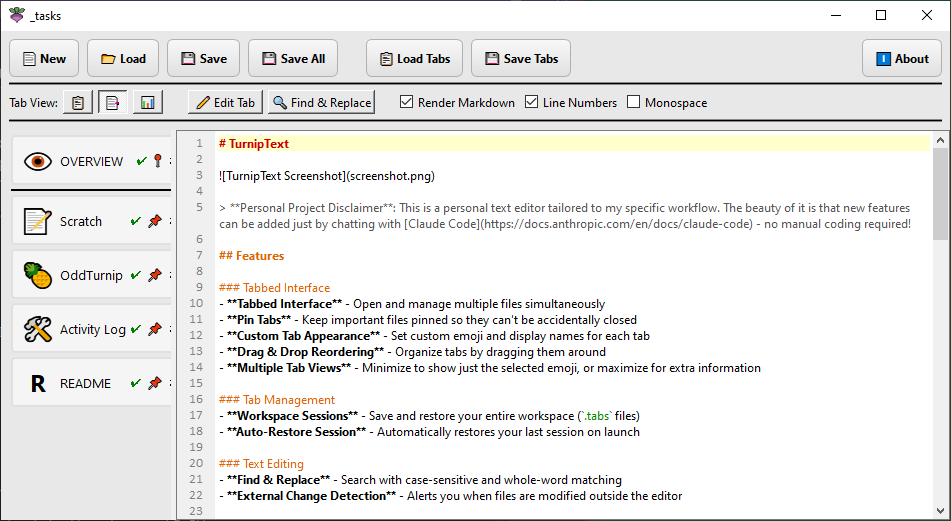

# TurnipText



> **Personal Project Disclaimer**: This is a personal text editor tailored to my specific workflow. The beauty of it is that new features can be added just by chatting with [Claude Code](https://docs.anthropic.com/en/docs/claude-code) - no manual coding required!

## Features

- **Tabbed Interface** - Open and manage multiple files simultaneously
- **Pin Tabs** - Keep important files pinned so they can't be accidentally closed
- **Custom Tab Appearance** - Set custom emoji and display names for each tab
- **Drag & Drop Reordering** - Organize tabs by dragging them around
- **Workspace Sessions** - Save and restore your entire workspace (`.tabs` files)
- **Find & Replace** - Search with case-sensitive and whole-word matching
- **Auto-Save Session** - Automatically restores your last session on launch
- **External Change Detection** - Alerts you when files are modified outside the editor
- **Three View Modes** - Minimized (emoji only), normal, or maximized tab sidebar

## Running Locally

### Prerequisites
- Python 3.8+
- PyQt6

### Install & Run

```bash
# Install dependencies
pip install -r requirements.txt

# Run the editor
python app.py

# Or load a saved workspace
python app.py myworkspace.tabs
```

## Creating an Executable

To create a standalone `.exe` (Windows), `.app` (macOS), or binary (Linux):

```bash
# Install PyInstaller
pip install pyinstaller

# Build the executable
pyinstaller TurnipText.spec --noconfirm

# Output will be in dist/TurnipText.exe (or dist/TurnipText on Linux/macOS)
```

On Windows, you can also just run `build_exe.bat`.

Once built, you can:
- **Pin to taskbar** - Run it once, right-click the taskbar icon, select "Pin to taskbar"
- **Associate .tabs files** - Right-click a `.tabs` file → Open with → Choose the executable → "Always use this app"

## Keyboard Shortcuts

| Shortcut | Action |
|----------|--------|
| Ctrl+N | New file |
| Ctrl+O | Open file |
| Ctrl+S | Save current tab |
| Ctrl+Shift+S | Save all files |
| Ctrl+F | Find & Replace |
| Ctrl+H | Find & Replace |

## Workspace Sessions

Save your entire workspace to a `.tabs` file:
1. Open all the files you want
2. Click **Save Tabs**
3. Choose a location and filename

The `.tabs` file stores:
- All open file paths
- Which tabs are pinned
- Custom emoji and display names
- The currently active tab

Load a workspace by clicking **Load Tabs** or passing the `.tabs` file as an argument.
